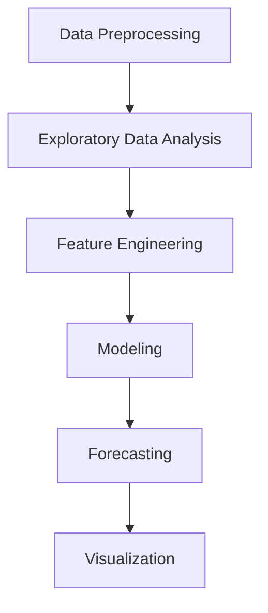

# Overview
This repository focuses on Time Series Analysis, providing tools and methodologies for analyzing, visualizing, and forecasting time series data. It includes scripts for data preprocessing, modeling, and visualization, leveraging popular Python libraries for time series analysis.

# Architecture
The repository is structured into logical components, each dedicated to a specific aspect of time series analysis. Below is a high-level overview of the architecture:



# Key Modules

<details>
<summary>Data Preprocessing</summary>

This module handles the cleaning and preparation of time series data. It includes functions for handling missing values, resampling, and normalization.

```python
import pandas as pd

def preprocess_data(df):
    # Handle missing values
    df.fillna(method='ffill', inplace=True)
    # Resample data to daily frequency
    df_resampled = df.resample('D').mean()
    return df_resampled
```
</details>

<details>
<summary>Exploratory Data Analysis (EDA)</summary>

This module focuses on understanding the dataset through visualization and statistical summaries.

```python
import matplotlib.pyplot as plt

def plot_time_series(df, column):
    plt.figure(figsize=(10, 6))
    plt.plot(df.index, df[column])
    plt.title(f'Time Series Plot of {column}')
    plt.xlabel('Date')
    plt.ylabel(column)
    plt.show()
```
</details>

<details>
<summary>Feature Engineering</summary>

This module creates additional features such as lagged variables, rolling statistics, and seasonal indicators to improve model performance.

```python
def add_lagged_features(df, column, lags):
    for lag in lags:
        df[f'{column}_lag_{lag}'] = df[column].shift(lag)
    return df
```
</details>

<details>
<summary>Modeling</summary>

This module includes the implementation of various time series models such as ARIMA, SARIMA, and Prophet.

```python
from statsmodels.tsa.arima.model import ARIMA

def fit_arima_model(df, column, order):
    model = ARIMA(df[column], order=order)
    model_fit = model.fit()
    return model_fit
```
</details>

<details>
<summary>Forecasting</summary>

This module generates future predictions based on the trained models.

```python
def forecast(model, steps):
    forecast = model.forecast(steps=steps)
    return forecast
```
</details>

<details>
<summary>Visualization</summary>

This module provides functions for visualizing model performance and forecast results.

```python
def plot_forecast(actual, forecast):
    plt.figure(figsize=(10, 6))
    plt.plot(actual.index, actual, label='Actual')
    plt.plot(forecast.index, forecast, label='Forecast')
    plt.title('Forecast vs Actual')
    plt.xlabel('Date')
    plt.ylabel('Value')
    plt.legend()
    plt.show()
```
</details>

# How It Works
1. **Data Preprocessing**: The raw time series data is cleaned and preprocessed to handle missing values and resampling.
2. **Exploratory Data Analysis**: Visualizations and statistical summaries are generated to understand the dataset.
3. **Feature Engineering**: Additional features such as lagged variables and rolling statistics are added to the dataset.
4. **Modeling**: Various time series models are implemented and trained on the dataset.
5. **Forecasting**: Future predictions are generated based on the trained models.
6. **Visualization**: Forecast results and model performance are visualized for interpretation.

# Technologies Used
The following technologies and tools are utilized in this repository:

| Technology | Description |
|------------|-------------|
| Python | Primary programming language used for analysis and modeling. |
| Pandas | Library for data manipulation and analysis. |
| NumPy | Library for numerical computations. |
| Matplotlib | Library for data visualization. |
| Seaborn | Advanced statistical visualization library. |
| Statsmodels | Library for statistical modeling, including ARIMA and SARIMA. |
| Prophet | Open-source forecasting tool developed by Facebook. |
| Scikit-learn | Library for machine learning algorithms and tools. |

# Importance and Use Cases
Time series analysis is crucial in various domains such as finance, economics, weather forecasting, and demand forecasting. This repository provides a comprehensive toolkit for analyzing and forecasting time series data, making it valuable for both research and practical applications.

# Conclusion
The Time Series Analysis repository offers a robust set of tools and methodologies for analyzing, modeling, and forecasting time series data. By leveraging popular Python libraries, it provides a flexible and powerful platform for time series analysis tasks. Whether for academic research or industry applications, this repository serves as a valuable resource for anyone working with time series data.
